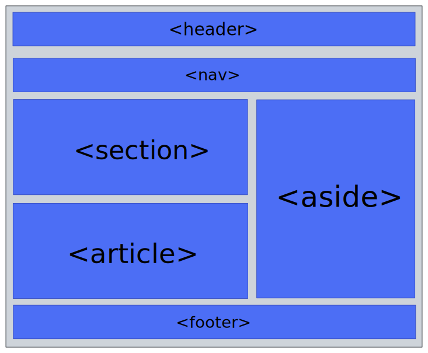

# Semantic HTML

- `div` and `span` tags tell nothing about the content they house.
- This is not a good practice considering SEO and accessibility.
- An example of a semantic HTML document: 
- There are about a 100 or more semantic HTML tags.
